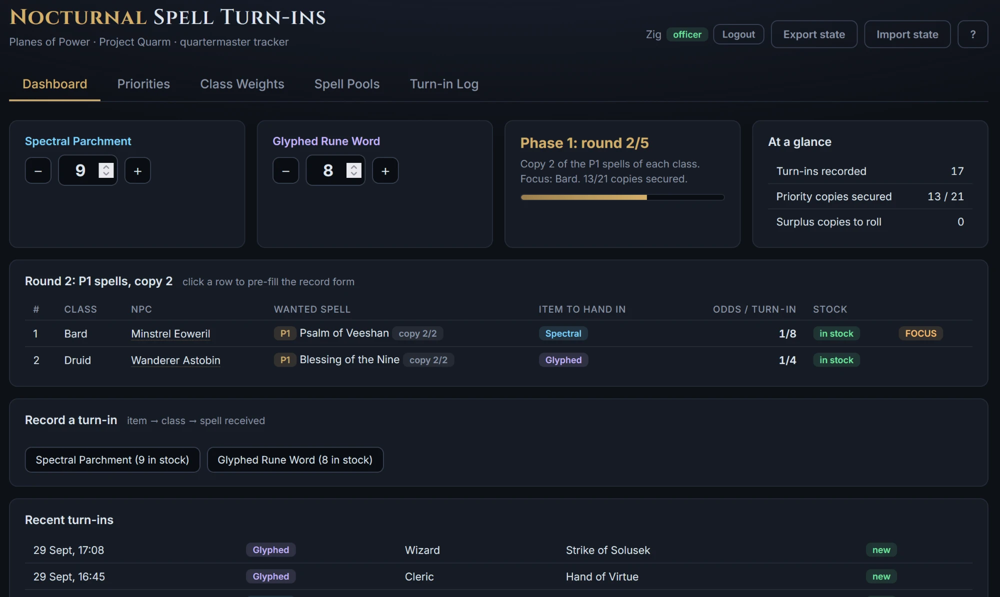
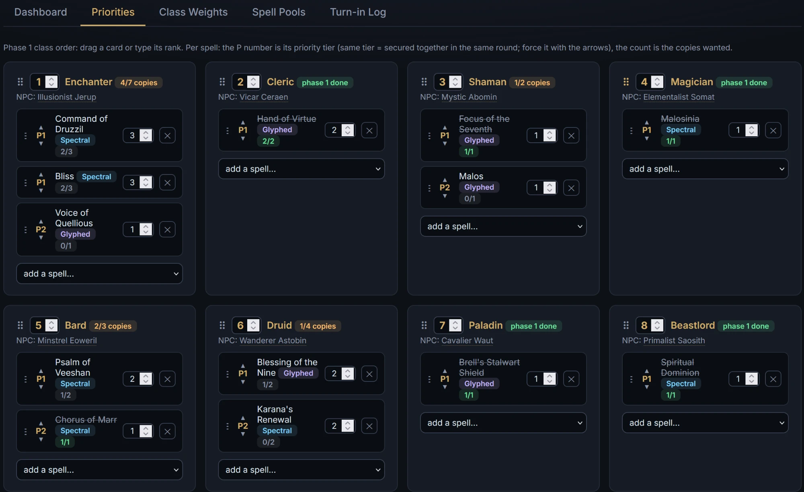
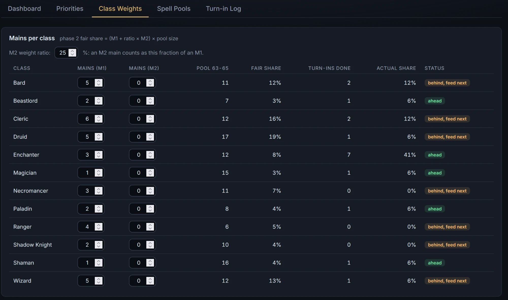
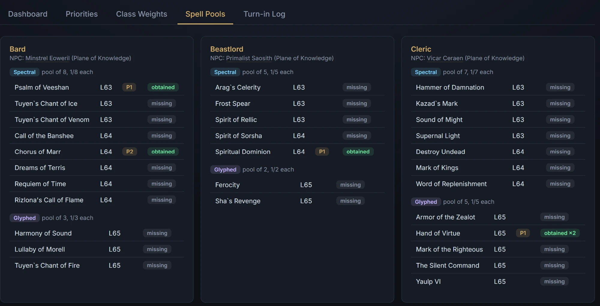
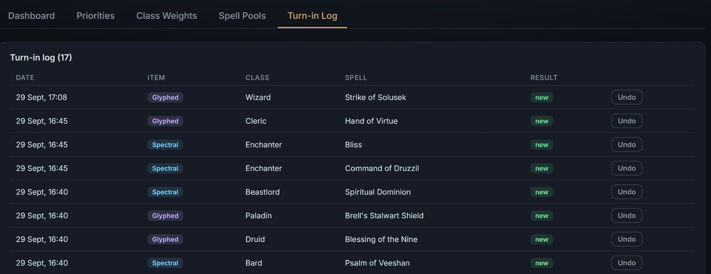

# Spell Turn-ins

PoP spell turn-in tracker for an EverQuest guild quartermaster on
**Project Quarm**. The guild name is a setting (`guildName` in
`config.json`) and brands the page title and header.



## The items

- **Spectral Parchment** → random level 63-64 spell
- **Glyphed Rune Word** → random level 65 spell

Each is handed to the class NPC in the Plane of Knowledge and rolls on that
class's fixed pool (odds = 1/pool size, from 1/2 up to 1/13 depending on
class and item). Pools are verified against [pqdi.cc](https://www.pqdi.cc).
A multiclass scroll counts as the NPC's class's spell, at that class's level
(e.g. Destroy Undead is CLR 64 at the Cleric NPC but NEC 65 at the
Necromancer NPC, so a level 65 spell can sit in a Spectral pool). Ethereal
Parchment exists in the dataset but is not tracked in v1.

## The rules

The tracker runs in two phases and always points at the next class to feed.

- **Phase 1: priorities.** Each class lists the spells it needs first. Every
  spell has a priority tier (P1, P2, ..., several spells may share a tier)
  and a wanted-copy count. Rounds walk the classes in the order set on the
  Priorities tab. A tier is fully served before the next one: round 1
  secures the first copy of every P1 spell, the following rounds their
  remaining copies. Only then do the P2 spells start. A copy counts as
  secured as soon as a matching turn-in is logged. Phase 1 ends when every
  listed spell has all its wanted copies.
- **Phase 2: fair share.** Each class gets a weight of (M1 + ratio × M2) ×
  pool size (its 63-65 spell count; an M2 main counts at a configurable
  ratio, 50% by default). The class furthest behind its fair share of all
  logged turn-ins (phase 1 included) is recommended next. Classes with zero
  weight are left out.
- **Duplicates.** Copies beyond a spell's wanted count, or repeats of a
  spell nobody listed, are flagged "duplicate, roll it". The roll itself
  happens in raid or Discord among mains; the app only counts them.

## The tabs

**Dashboard** is the daily screen.

- Two inventory cards hold the Spectral and Glyphed stock (+/- buttons or a
  direct input).
- A phase card shows where the guild stands: setup until priorities exist,
  then the current phase 1 round and its focus class, then phase 2, with a
  progress bar of secured copies over planned copies.
- In phase 1, a queue table lists the pending classes of the current round:
  the spell to chase with its tier and copy number, the item to hand in,
  the odds, and whether that item is in stock. The top row is the class to
  feed first. Clicking a row pre-fills the record form.
- In phase 2, the table ranks classes by deficit, with mains, pool size,
  fair share and turn-ins done.
- **Record a turn-in** takes three clicks: the item, the class, the spell
  that dropped. It refuses when the item's stock is zero, and a successful
  record takes one item off the stock. The item stays selected, so a stack
  of parchments records fast. A toast says whether the copy is secured, a
  plain record, or a surplus to roll.
- **Recent turn-ins** shows the last six entries with their result.

**Priorities** holds the plan: one card per class. Drag a card onto another,
or type a rank in its header, to set the phase 1 class order. Each spell row
has arrows to move it between tiers (drag a row onto another to share its
tier), a wanted-copies input and a remove button. The dropdown at the bottom
adds any of the class's turn-in spells on a new tier with one wanted copy.
Classes without priorities sit out phase 1.



**Class Weights** holds the phase 2 inputs: M1 and M2 mains per class, plus
the M2 ratio (what fraction of an M1 an M2 counts as). Read-only columns
compare each class's fair share to its actual share, with a
behind/ahead/excluded badge.



**Spell Pools** is the read-only reference: per class, the NPC and each pool
with its odds. Each spell carries a status badge: obtained (×N), obtained*
(the scroll dropped at another class's NPC, see below), or missing.



**Turn-in Log** lists every recorded turn-in, newest first. Undo deletes the
entry and puts the item back in stock.



## Cross-class drops

Some scrolls teach several classes, so a spell one class wants can drop from
another class's pool. The app shows these copies but never counts them: an
"obtained*" badge on the Pools tab, an "N dropped elsewhere" badge in the
phase 1 queue. One scroll serves one player, and who gets it is the
quartermaster's call. If the scroll does go to the class, lower that spell's
wanted copies by hand on the Priorities tab; nothing adjusts itself.

## Everything else

- Hovering an NPC name (queue, class cards, record form, pools) shows a
  Plane of Knowledge minimap with that librarian's spot marked.
- **Export state** downloads the whole tracking state as a JSON file;
  **Import state** loads one back (officers only when hosted).
- The **?** header button opens a condensed version of these rules in the
  app.
- Local mode (no API, state in the browser) and hosted mode (Discord
  sign-in, officers write, raiders read) are described under Running
  locally and Hosting below.

## Using it for your guild

Everything guild-specific lives in `config.json`, `api/secrets.php` and the
tracking state itself; the code needs no edits.

1. Fork or copy the repository.
2. Edit `config.json`:
   - `guildName` brands the page title, the header and the export filenames.
   - `guildId` is your Discord server id.
   - `roles.officer` / `roles.raider` are arrays of Discord role ids
     (officers write, raiders read).
   - `sessionEpoch` stays at 1; increment it later to force-logout every
     outstanding session at once.
3. Create your own Discord application and your own `api/secrets.php`
   (copy `api/secrets.sample.php`, never commit or publish it). The exact
   steps and the deployment itself are in "Hosting (Discord auth)" below.
4. In the app, set your class priority order, per-spell tiers and wanted
   copies (Priorities tab) and your M1/M2 counts and ratio (Class Weights
   tab). That is your distribution policy; it is plain state, so Export
   state / Import state moves it between installs.

The spell pools in `data/spells.js` target Project Quarm. If your server's
pools differ, regenerate the file with `tools/parse_bank.py` from your own
bank export (the worksheet must be named Spell bank; CLAUDE.md, section
"Regenerate the spell data", documents the column layout) and check the
`validation` lines it embeds; [pqdi.cc](https://www.pqdi.cc) is the
reference for pool contents and odds.

## Running locally

```bash
python -m http.server 8123
```

Static page, no build step, open <http://localhost:8123>. Without the PHP
API the app runs in local mode: full write access, state in localStorage.

## Hosting (Discord auth)

Online, the app uses a small PHP API (`api/`): Discord sign-in, officers
write, raiders read, shared state on the server. It targets any web hosting
with **PHP 8+ and Apache** (`.htaccess` support), e.g. classic shared
hosting plans; no database is needed.

**1. Discord application**
- Create an application at <https://discord.com/developers/applications>.
- OAuth2 tab: add the redirect `https://YOUR-DOMAIN/api/callback.php`,
  copy the Client ID and Client Secret.
- In Discord (developer mode on), right-click your server and the two roles
  to copy their IDs.

**2. Configuration**
- Edit `config.json`: guild name, server ID, officer role IDs, raider role
  IDs.
- Copy `api/secrets.sample.php` to `api/secrets.php` and fill in the client
  ID/secret, the exact redirect URI, and a random `app_secret` (32+ chars).
  Never publish `secrets.php`.

**3. Upload**
- Upload everything to the site's web root.
- In your host's control panel: enable HTTPS (e.g. a free Let's Encrypt
  certificate) and select PHP 8.x. HTTPS is required by the OAuth callback
  and the session cookies.
- Make sure the `.htaccess` files are uploaded too (some FTP clients skip
  dotfiles): they block web access to `storage/` and the secrets. The API
  also recreates the `storage/` guard by itself if it goes missing.

**4. First run**
- Open the site: it shows "Sign in with Discord".
- Log in as an officer, then use **Import state** to push a local export
  (made with Export state on a localStorage version).
- Sessions last 7 days; role changes on Discord apply at the next login.
  To force-logout everyone immediately (e.g. after demoting an officer),
  increment `sessionEpoch` in `config.json`.

The API is a handful of endpoints: `me.php` (session), `state.php` (GET for
members, POST for officers with a revision check: concurrent saves get a 409
and the app reloads the newer version), `login/callback/logout.php` (OAuth),
and `health.php` (deployment self-check).

**Troubleshooting "Server save failed (...)"**
The toast shows the HTTP status and the server's message. While logged in,
open `https://YOUR-DOMAIN/api/health.php`: it reports the PHP version, curl,
HTTPS detection, and whether `storage/` exists and is writable. Typical
causes: `storage/` not writable (fix the folder permissions via FTP),
missing curl extension, or the host's security module blocking the request
(the app saves via POST precisely to avoid the commonly blocked PUT verb).

## Files

| Path | Role |
| --- | --- |
| `index.html` / `styles.css` / `app.js` | Single-page app (vanilla JS) |
| `data/spells.js` | Static dataset: classes, NPCs, turn-in pools |
| `data/pok_map.js` | Plane of Knowledge minimap shown when hovering an NPC name |
| `api/` | PHP API: Discord OAuth, sessions, shared state |
| `config.json` | Guild name, Discord server and role ids, session epoch |

In local mode the tracking state lives in `localStorage`; online it is
shared through the API. Use **Export state / Import state** to back it up
or move it around.

## License

[MIT](LICENSE).
